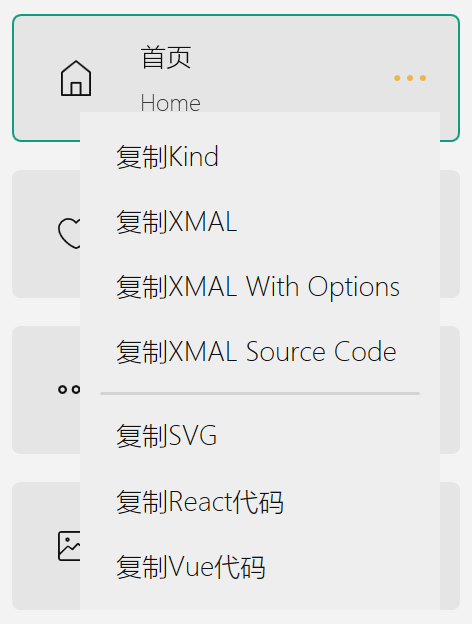

# [IconPark](http://iconpark.bytedance.com/official)

<div align="center">
 <a href="http://iconpark.bytedance.com/official">
    
</a>
</div>

## 介绍

IconPark提供了超过2000个高质量图标，并且提供了一个界面来帮你定制图标。我非常喜欢这套图标，于是我开发了适用于WPF的版本，目前只支持线性图标，但也已满足了我的需求，至于原IconPark图标所含有的主题切换技术，这个库还没有实现，甚至还有十几个图标未转换成功而不能使用。如果您也喜欢这套图标而懒于自己实现，可以在您的项目中试试IconPark.Xaml.


### 如何使用

#### 安装

可以在NuGet管理器中搜索 IconPark.Xaml，也可以执行命令直接安装

```

install-package IconPark.Xaml

```

#### 使用

在您的程序中使用 IconPark.Xaml 需要增加命名空间

```

xmlns:IconPark="https://iconpark.oceanengine.com"

```

在需要使用Icon的位置写入代码，例如：

```

<IconPark:Icon Kind="List"/>

```

#### 便捷操作

> 你可以应用在 Figma, Sketch, Photoshop, PPT等等场景里，这里有一些快捷操作：
  - 复制XMAL源码   
  - 复制SVG源码
  - 复制React图标代码组件
  - 复制Vue图标代码组件

</img>    

### 感谢

[IconPark](https://github.com/bytedance/iconpark)